# TsuriSpot システム構成図

**最終更新: 2026-03-24**

---

## 全体アーキテクチャ

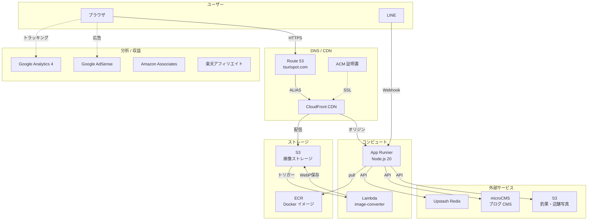

---

## CI/CD パイプライン

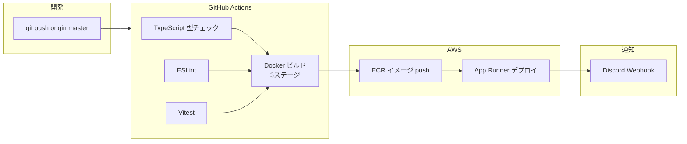

---

## 定期実行ワークフロー（GitHub Actions Cron）

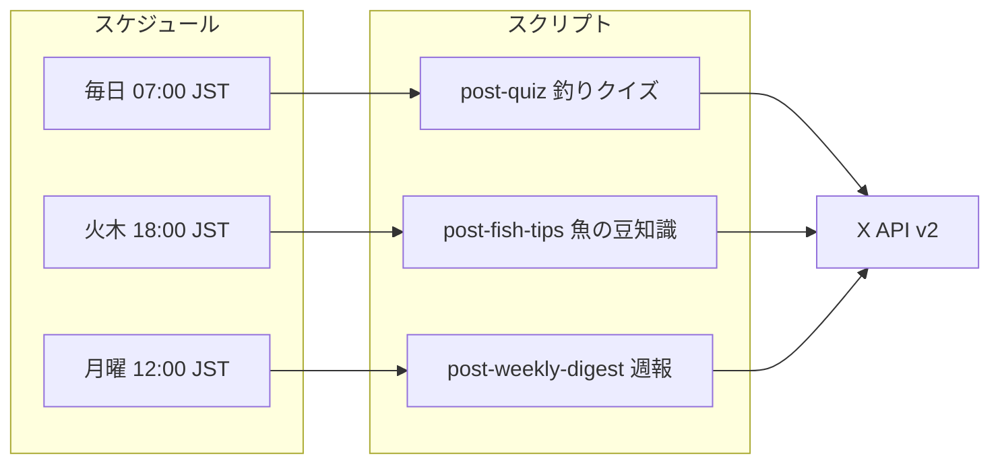

---

## Docker 3ステージビルド

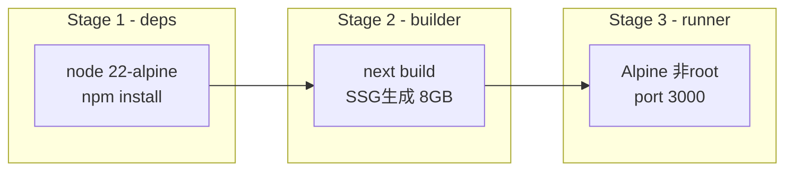

---

## データフロー

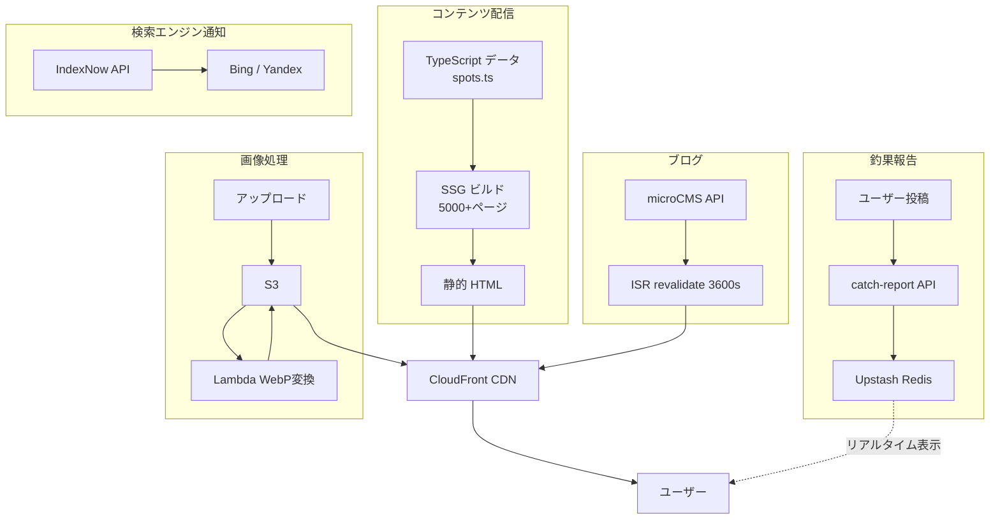

---

## API エンドポイント

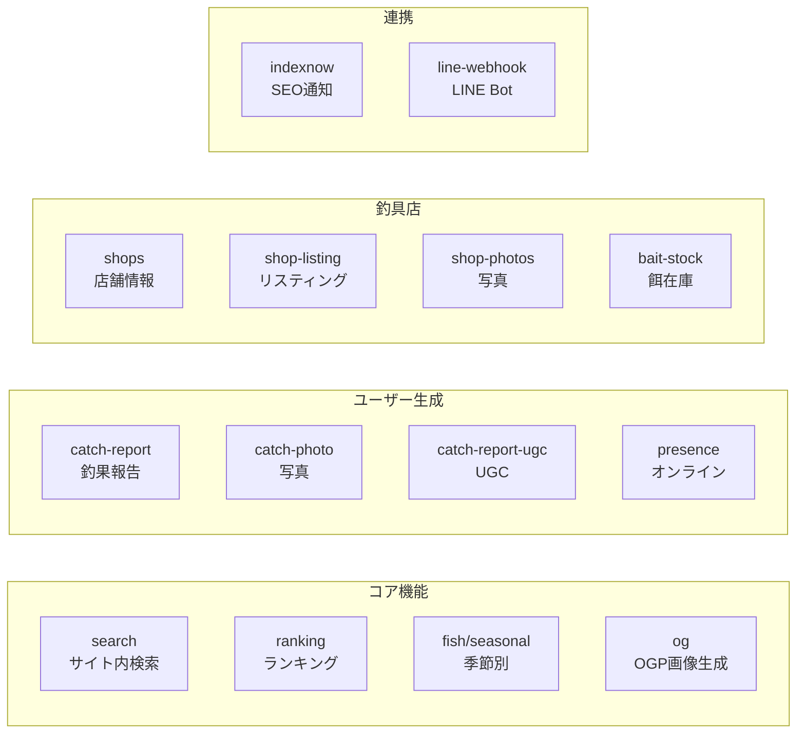

---

## セキュリティ

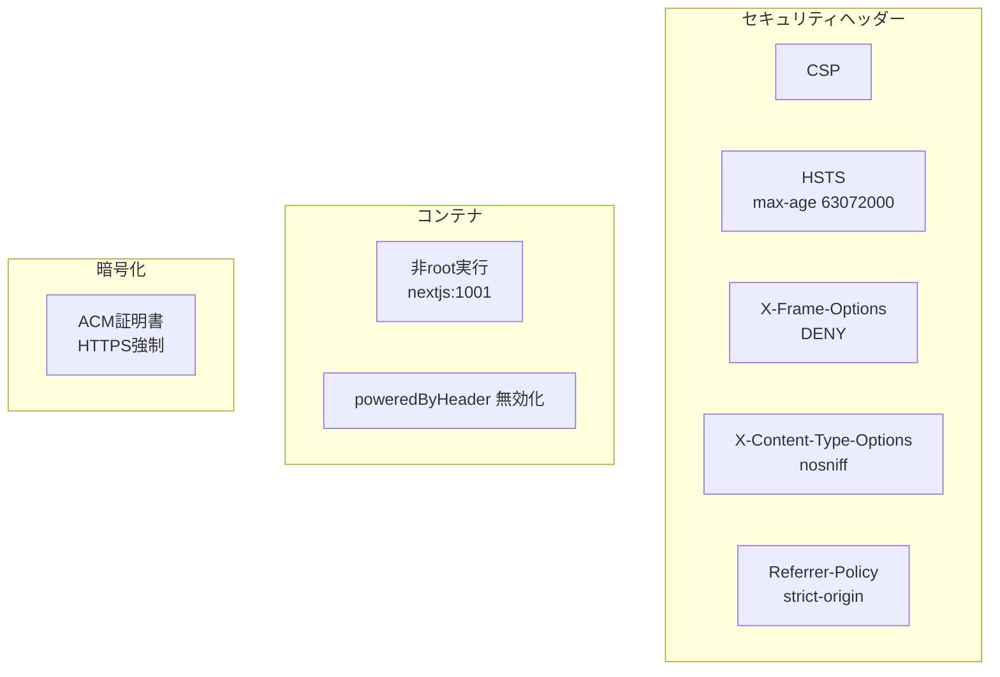

---

## キャッシュ戦略

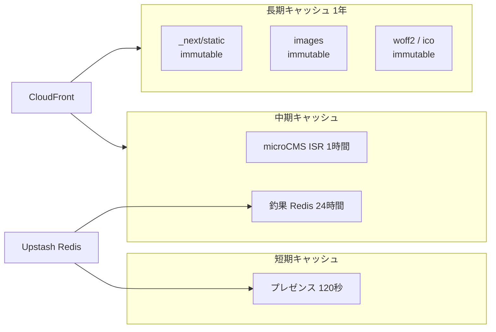

---

## テックスタック

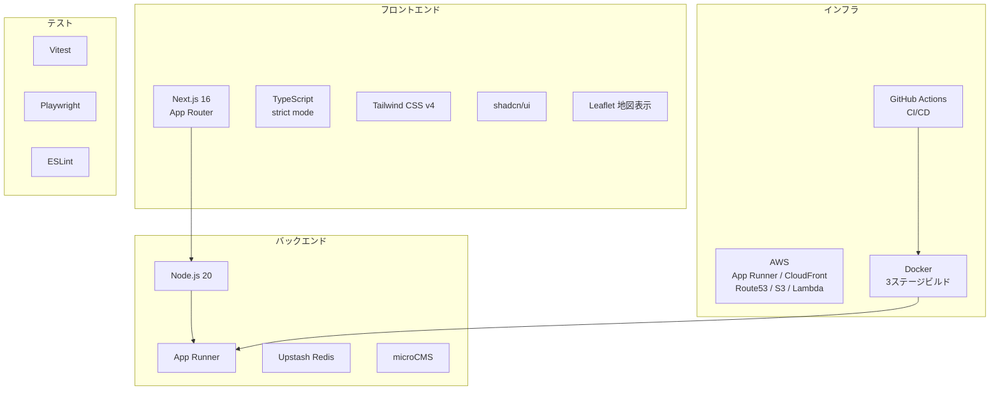

---

## 環境変数一覧

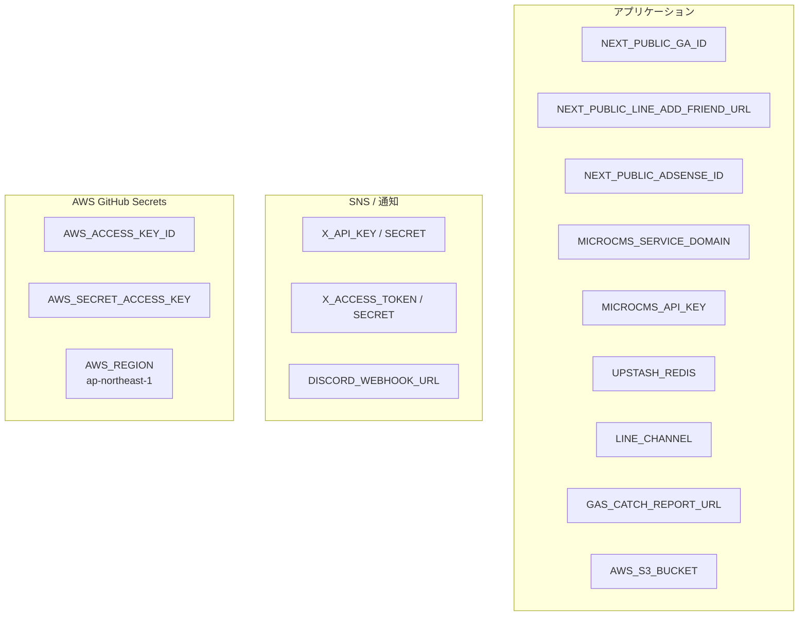

---

## コスト構造

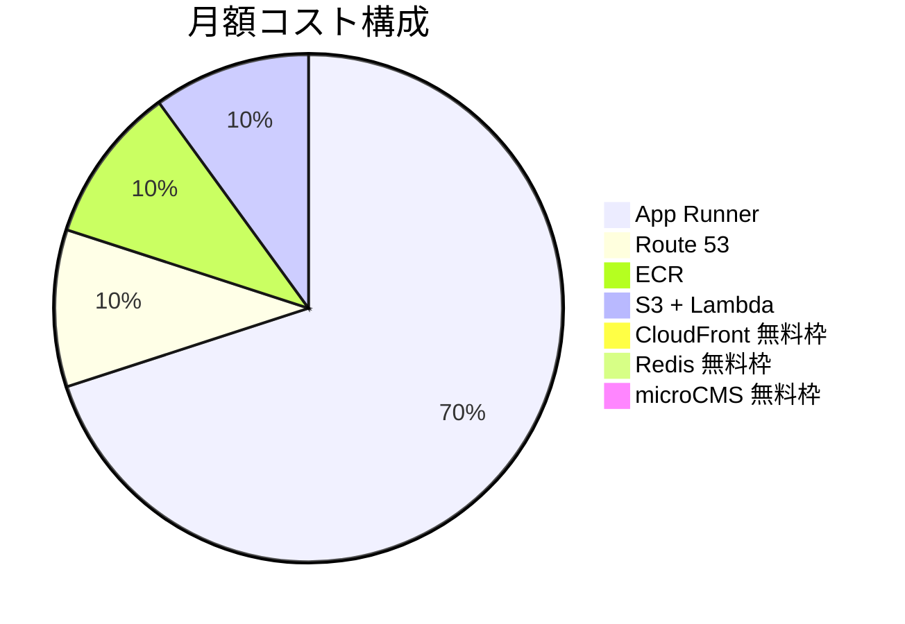

| サービス | 料金 |
|----------|------|
| App Runner | 従量課金（vCPU + メモリ時間） |
| CloudFront | 無料枠 1TB/月 + 1000万リクエスト |
| Route 53 | $0.50/ホストゾーン/月 |
| ACM | 無料 |
| Lambda | 無料枠 100万リクエスト/月 |
| S3 | 従量課金（ストレージ + リクエスト） |
| ECR | 500MB無料、以降 $0.10/GB/月 |
| Upstash Redis | 無料枠（日次8,000コマンド） |
| microCMS | 無料プラン |
